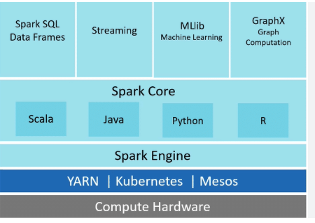

# Apache Spark Ecosystem

The Apache Spark ecosystem refers to the collection of tools, libraries, and components that surround the Apache Spark distributed computing framework. This ecosystem is designed to enhance the capabilities of Spark and make it more versatile and easier to use for various Big Data processing and analytics tasks. Below Figure  shows the components of the Spark ecosystem. 

 

## Spark Core

**Spark Core and RDD (Resilient Distributed Dataset):**

Spark Core is embedded with a special collection called **RDD (Resilient Distributed Dataset)**. RDD is among the abstractions of Spark. Spark RDD handles partitioning data across all the nodes in a cluster. It holds them in the memory pool of the cluster as a single unit.

There are two operations performed on RDDs: **Transformation** and **Action**.

- **Transformation:**  
  It is a function that produces new RDD from the existing RDDs.

- **Action:**  
  In Transformation, RDDs are created from each other. But when we want to work with the actual dataset, then, at that point we use Action.

---

## Features of Spark Core

Spark Core is the fundamental component of the Big Data ecosystem that provides features like:

- Resource management  
- Job scheduling  
- Fault tolerance  
- Interface with external storage systems

## Libraries Built on Spark Core

Spark SQL, Streaming, MLlib, and GraphX are built on Spark Core and provide specialised functionalities for specific data processing tasks.

### Spark SQL

Spark SQL enables working with structured data using SQL-like queries.

### Spark Streaming

Spark Streaming provides stream processing functionalities for handling real-time data.

### MLlib

MLlib offers various machine learning algorithms for tasks like:

- Classification  
- Regression  
- Clustering

### GraphX

GraphX offers functionalities for graph processing tasks like:

- Creating graphs  
- Manipulating graph data  
- Running graph algorithms

## Cluster Managers

Spark can be deployed on cluster managers like:

- YARN  
- Mesos  
- Kubernetes

## Alternative Tools

Several alternative tools and frameworks for Apache Spark are popular in the market. Some of the best ones include:

- Hadoop MapReduce  
- Apache Flink  
- Apache Storm  
- SQL  
- Pandas  

These tools offer different features and capabilities. Table 1 compares Apache Spark with its top alternative tools.
# Table 1: Comparison of Apache Spark with Other Popular Tools

| Feature              | Apache Spark                                      | Apache Hadoop                                 | SQL                                             | Pandas                                             |
|----------------------|---------------------------------------------------|------------------------------------------------|--------------------------------------------------|----------------------------------------------------|
| **Primary use**      | Big Data processing, analytics, machine learning  | Distributed storage and processing             | Querying and managing relational databases       | Data manipulation and analysis in Python           |
| **Programming model**| Scala, Java, Python, R                            | Java                                           | Relational database management system (RDBMS)    | Python                                             |
| **Fault tolerance**  | Provides fault tolerance through lineage and RDDs | Provides fault tolerance through replication and checkpointing | Depends on the DBMS and its configuration | Limited fault tolerance mechanisms                 |
| **Performance**      | In-memory processing, faster than Hadoop          | Slower than Spark, disk-based processing       | N/A                                              | Fast, but limited by memory and single machine     |
| **Ease of use**      | High                                              | Lower than Spark, complex MapReduce programming| High for querying, moderate for complex tasks    | High                                                |
| **Machine learning** | Built-in MLlib library                            | Can integrate with various machine learning tools | Limited to querying, no built-in ML capabilities | Can integrate with machine learning libraries       |
