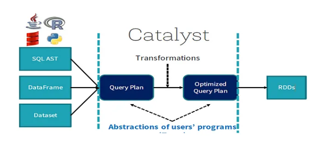

## Catalyst Optimizer:

# What is Catalyst Optimizer?
The Catalyst Optimizer is a core component of Apache Spark's SQL engine (Spark SQL) that automatically finds the most efficient plan for executing data operations. It transforms user-defined SQL or DataFrame operations into a physical execution plan, improving query execution time by applying various optimization techniques. 

# Explanation:
 

Suppose we provide our code using SQL, DataFrame API, or Dataset API — the Catalyst Optimizer processes this code through different phases. These phases generate an optimized plan that eventually gets converted into RDDs or Java bytecode for execution.
We will discuss these four phases in detail below.

 

## Four Phases of Catalyst Optimizer are:
**1.  Analysis:**
This phase resolves references, such as table names and column names, and ensures the logical plan is valid and complete. As explained by Databricks.  
- In Analysis Phase we have catalog which contains the metadata of data. 
- So, in Analysis Phase it will check that file or a particular column is present or not if not then wit will throw **Analysis Error Exception**. 
**2. Logical Optimization:**
This phase applies rule-based optimizations to the logical plan, transforming it to a more efficient form. Examples include predicate pushdown, projection pruning, and constant folding, according to Databricks.  

**3. Physical Planning:**
The optimized logical plan is converted into a physical plan, which specifies how the query will be executed on Spark. This involves selecting the best execution strategy, such as broadcast joins or shuffle joins.  

After the logical plan is optimized, multiple physical plans are generated. Spark then applies a cost-based model to evaluate each plan and determine which one uses the resources in the most efficient way. The plan with the lowest cost is selected as the best physical plan (also known as the selected physical plan).

This selected plan is ultimately translated into a set of RDDs (Resilient Distributed Datasets) that are executed on the Spark cluster.

**4. Code Generation:**
This phase compiles parts of the query to Java bytecode for optimized execution on the Spark cluster, 

**NOTE:**
**Is SPARK SQL ENGINE A COMPILER? YES**