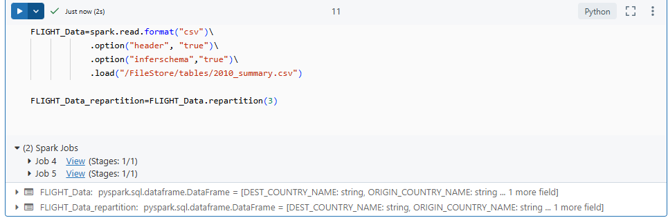
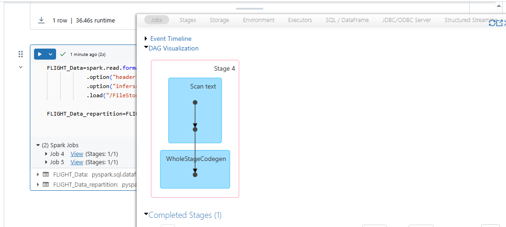
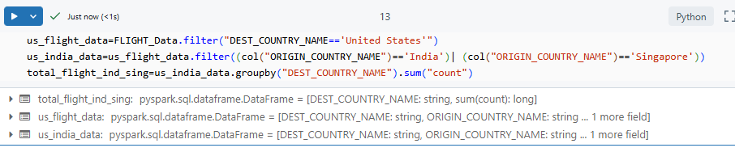
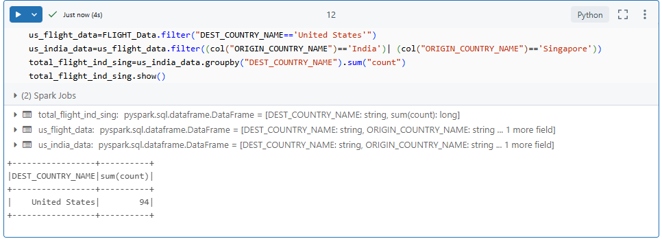

## DAG: Directed Acyclic Graph

In Apache Spark, a **DAG (Directed Acyclic Graph)** is created for each job. The DAG represents the sequence of computations performed on the data. It is a logical execution plan built by Spark based on the transformations and actions applied to the data.

### When is a Job Created?

A **job is created when an action is triggered**. Spark follows **lazy evaluation**, which means transformations are not executed immediately. Instead, Spark builds up a logical plan (DAG) and only triggers execution when an action (such as `.show()`, `.collect()`, etc.) is called.

### Example Explanation

In the example discussed below, we see two Spark jobs created. Here's why:

```python
from pyspark.sql.functions import col

FLIGHT_Data=spark.read.format("csv")\
            .option("header", "true")\
            .option("inferschema","true")\
            .load("/FileStore/tables/2010_summary.csv")

FLIGHT_Data_repartition=FLIGHT_Data.repartition(3)
```



- The `.read()` method is considered an **action** because it reads a sample of data to infer schema.
- The `inferSchema` option triggers **another internal action** to analyze data types.

Thus, both `.read()` and `inferSchema` result in two separate jobs being triggered.

### Visual Explanation

In the Databricks UI or Spark UI, we can visually see that **2 jobs are created** as a result of the read and schema inference actions.<br>
<br>

---

## Lazy Evaluation Example
In the example below, we can observe Spark's lazy evaluation behavior:

```python
us_flight_data=FLIGHT_Data.filter("DEST_COUNTRY_NAME=='United States'")
us_india_data=us_flight_data.filter((col("ORIGIN_COUNTRY_NAME")=='India')| (col("ORIGIN_COUNTRY_NAME")=='Singapore'))
total_flight_ind_sing=us_india_data.groupby("DEST_COUNTRY_NAME").sum("count")
```
In this example, no jobs will be triggered because no actions are invoked.
<br>

---

Now, let's look at a slightly modified example that triggers actions:
```python
us_flight_data=FLIGHT_Data.filter("DEST_COUNTRY_NAME=='United States'")
us_india_data=us_flight_data.filter((col("ORIGIN_COUNTRY_NAME")=='India')| (col("ORIGIN_COUNTRY_NAME")=='Singapore'))
total_flight_ind_sing=us_india_data.groupby("DEST_COUNTRY_NAME").sum("count")
total_flight_ind_sing.show()
```
In this case, a job will be triggered because the .show() action is invoked, which forces the computation to run.
<br>
