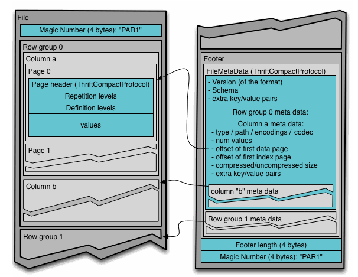

# WHAT IS APACHE PARQUET FILE:

IT is a *Columnar based file format* designed for efficient data storage and retrieval, especially for big data processing frameworks like Apache Spark, Hive, Impala, etc.

## 📊WHAT IS COLUMNAR BASED FILE FORMAT AND ROW BASED FILE FORMAT?
🧱 Row-Based File Format:
Data is stored row by row.

Example: CSV, JSON, Avro.

Good for transactional systems where you need to access or write entire records frequently.<br>

*Structure Example (Column-based):*

```python
ID, Name, Age
1, Alice, 25
2, Bob, 30
3, Carol, 28
```
Stored in file as:
```python
[1, Alice, 25][2, Bob, 30][3, Carol, 28]
```
Pros:

- Fast row-wise access
- Simpler format, human-readable (CSV/JSON)

Cons:

- Not efficient for reading specific columns from large datasets
- Compression is less effective across heterogeneous data types

🧮 Columnar-Based File Format:
Data is stored column by column.

Example: Parquet, ORC.

Ideal for analytical workloads where you query only a few columns from a large table.

*Structure Example (Column-based):*
```python
Column ID: [1, 2, 3]
Column Name: [Alice, Bob, Carol]
Column Age: [25, 30, 28]
```
Pros:

- Faster column-wise reads
- Better compression (similar data types in a column)
- Reduced I/O when querying subsets of columns

Cons:

- Slower for writing/updating individual records
- More complex structure

⚖️ When to Use What?
- In OLTP (Online Transaction Processing) systems, operations like insert, update, and delete are common.
For such workloads, row-based file formats are more efficient.

  Example:
Suppose we have a dataset of customer records.
If we want to update the details of the 3rd customer, it’s faster and easier to locate and modify the entire row in a row-based format like JSON or CSV.

- In OLAP (Online Analytical Processing) systems, the focus is primarily on read-heavy operations, such as running complex queries and aggregations on large datasets.
For such use cases, columnar-based file formats like Parquet or ORC are preferred.

   Reason: <br>
  Analytics often involves accessing specific columns (e.g., SELECT avg(salary) FROM employees).
   With columnar format, only the needed columns are read, which leads to faster performance and reduced I/O.<br>

🌀 *Is Parquet Truly Columnar?*
Parquet is not purely columnar — it's actually a hybrid format.<br>

🔹 *Why a Hybrid Model?*
While Parquet stores data by column, it also groups rows into blocks (called row groups) and stores column chunks within those row groups.

*This design balances:*

Efficient column-wise reads (for analytics), and
Reasonable seek performance when accessing a specific row (like the 200,000th row).

📦 *How Parquet Stores Data (Internals)
Row Groups:*
Data is divided into blocks of rows, e.g., every 100,000 rows.

*Within each row group:*

Data is stored column-wise (e.g., all values of Column A, then B, then C).

Each column chunk can be compressed and encoded independently.

Think of it as a table being split horizontally into row groups, and each group is then stored vertically by columns.

📘 *Example:*
You have 300,000 rows and 3 columns (ColA, ColB, ColC).
Parquet stores them like this:
```python
Row Group 1 (Rows 0-99,999)
 → ColA_chunk1: A0, A1, ..., A99999
 → ColB_chunk1: B0, B1, ..., B99999
 → ColC_chunk1: C0, C1, ..., C99999

Row Group 2 (Rows 100,000-199,999)
 → ColA_chunk2: A100000, ..., A199999
 ...

Row Group 3 (Rows 200,000-299,999)
 → ColA_chunk3: A200000, ..., A299999
 ...
```
Now if you want the 200,000th row, you only scan Row Group 3, not the whole file.
And within Row Group 3, Parquet only reads the needed column chunks, if you're querying selected columns.

*NOTE:*
- Parquet is Structred file format
- Parquet is binary file format

*Structure of parquet file-format:*

<br>


