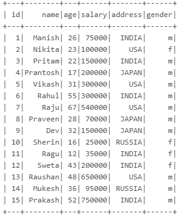

## Partitioning And Bucketing

# What is Partitioning:
Partitioning is the process of dividing your data based on the values of one or more columns when writing it to storage. Each partition is stored in a separate folder, making it easier and faster to query data related to specific values.

For example, if you partition data on the address column, Spark will store the data in separate directories like:
```python
address=USA/
address=INDIA/
address=JAPAN/
```
This makes it efficient when querying for specific address values (like only data from INDIA), as Spark only scans the relevant partition.

Suppose in the data below we want to partition by the name "Manish". Since "Manish" occurs only once, it will create a very small partition. This is not ideal.

<br>


# Example 1: Partitioning by Address
```python
DF=spark.read.format("csv")\
            .option("header", "true")\
            .option("inferschema","false")\
            .option("mode","FAILFAST")\
            .load("/FileStore/tables/Data_Practice.csv")
DF.show()

DF.write.format("csv")\
        .option("header","true")\
        .option("mode","overwrite")\
        .option("path","/FileStore/tables/Partition_By_Address/")\
         .partitionBy("address")\
         .save()

dbutils.fs.ls("/FileStore/tables/Partition_By_Address/",)
```
output:
```python
Out[19]: [FileInfo(path='dbfs:/FileStore/tables/Partition_By_Address/_SUCCESS', name='_SUCCESS', size=0, modificationTime=1747753251000),
 FileInfo(path='dbfs:/FileStore/tables/Partition_By_Address/address=INDIA/', name='address=INDIA/', size=0, modificationTime=0),
 FileInfo(path='dbfs:/FileStore/tables/Partition_By_Address/address=JAPAN/', name='address=JAPAN/', size=0, modificationTime=0),
 FileInfo(path='dbfs:/FileStore/tables/Partition_By_Address/address=RUSSIA/', name='address=RUSSIA/', size=0, modificationTime=0),
 FileInfo(path='dbfs:/FileStore/tables/Partition_By_Address/address=USA/', name='address=USA/', size=0, modificationTime=0)]

 ```
 Advantage:
If you only want data from INDIA, Spark will directly scan /address=INDIA/, improving query performance.

# When Partitioning Can Be a Problem

Partitioning on high-cardinality columns (like id, where each value is unique) creates too many small partitions. For example:

```python
DF.write.format("csv")\
        .option("header","true")\
        .option("mode","overwrite")\
        .option("path","/FileStore/tables/Partition_By_Id/")\
         .partitionBy("id")\
         .save()

dbutils.fs.ls("/FileStore/tables/Partition_By_Id/",)
```
Output:
```python
Out[22]: [FileInfo(path='dbfs:/FileStore/tables/Partition_By_Id/_SUCCESS', name='_SUCCESS', size=0, modificationTime=1747753315000),
 FileInfo(path='dbfs:/FileStore/tables/Partition_By_Id/id=1/', name='id=1/', size=0, modificationTime=0),
 FileInfo(path='dbfs:/FileStore/tables/Partition_By_Id/id=10/', name='id=10/', size=0, modificationTime=0),
 FileInfo(path='dbfs:/FileStore/tables/Partition_By_Id/id=11/', name='id=11/', size=0, modificationTime=0),
 FileInfo(path='dbfs:/FileStore/tables/Partition_By_Id/id=12/', name='id=12/', size=0, modificationTime=0),
 FileInfo(path='dbfs:/FileStore/tables/Partition_By_Id/id=13/', name='id=13/', size=0, modificationTime=0),
 FileInfo(path='dbfs:/FileStore/tables/Partition_By_Id/id=14/', name='id=14/', size=0, modificationTime=0),
 FileInfo(path='dbfs:/FileStore/tables/Partition_By_Id/id=15/', name='id=15/', size=0, modificationTime=0),
 FileInfo(path='dbfs:/FileStore/tables/Partition_By_Id/id=2/', name='id=2/', size=0, modificationTime=0),
 FileInfo(path='dbfs:/FileStore/tables/Partition_By_Id/id=3/', name='id=3/', size=0, modificationTime=0),
 FileInfo(path='dbfs:/FileStore/tables/Partition_By_Id/id=4/', name='id=4/', size=0, modificationTime=0),
 FileInfo(path='dbfs:/FileStore/tables/Partition_By_Id/id=5/', name='id=5/', size=0, modificationTime=0),
 FileInfo(path='dbfs:/FileStore/tables/Partition_By_Id/id=6/', name='id=6/', size=0, modificationTime=0),
 FileInfo(path='dbfs:/FileStore/tables/Partition_By_Id/id=7/', name='id=7/', size=0, modificationTime=0),
 FileInfo(path='dbfs:/FileStore/tables/Partition_By_Id/id=8/', name='id=8/', size=0, modificationTime=0),
 FileInfo(path='dbfs:/FileStore/tables/Partition_By_Id/id=9/', name='id=9/', size=0, modificationTime=0)]
 ```
 So here we are doing partition on id now it is divided in small chunk of data for each id so If the dataset has millions of unique id values, Spark will create millions of folders, which is inefficient and degrades performance.

 **NOTE:**  We can also partition data on two columns. But we need to specify the columns in the right order.

If we want to partition first by address, then by gender, we write:
```python
.partitionBy("address", "gender")
```

## What is Bucketing:
Bucketing is a technique used to distribute data into a fixed number of buckets (files) based on the hash of a column. Unlike partitioning, bucketing does not create subdirectories — it creates multiple files within the same folder.

This is especially useful when:

- Data is too random for partitioning

- You want to optimize join performance

- You want a fixed number of output files
# Use Bucketing When:
- You have high-cardinality columns like id, and you don’t want thousands/millions of partitions

- You want a consistent number of files

```python
DF.write.format("csv")\
        .option("header","true")\
        .option("mode","overwrite")\
        .option("path","/FileStore/tables/bucket_By_Id/")\
         .bucketBy(3,"id")\
         .saveAsTable("bucket_by_id_table")

dbutils.fs.ls("/FileStore/tables/bucket_By_Id/")
```
Output:
We see that 3 buckets are created:

```python
Out[31]: [FileInfo(path='dbfs:/FileStore/tables/bucket_By_Id/_SUCCESS', name='_SUCCESS', size=0, modificationTime=1747753862000),
 FileInfo(path='dbfs:/FileStore/tables/bucket_By_Id/_committed_5592527146531380392', name='_committed_5592527146531380392', size=306, modificationTime=1747753862000),
 FileInfo(path='dbfs:/FileStore/tables/bucket_By_Id/_started_5592527146531380392', name='_started_5592527146531380392', size=0, modificationTime=1747753861000),
 FileInfo(path='dbfs:/FileStore/tables/bucket_By_Id/part-00000-tid-5592527146531380392-2972990c-0d56-4137-ad74-399e10fb6813-22-1_00000.c000.csv', name='part-00000-tid-5592527146531380392-2972990c-0d56-4137-ad74-399e10fb6813-22-1_00000.c000.csv', size=239, modificationTime=1747753861000),
 FileInfo(path='dbfs:/FileStore/tables/bucket_By_Id/part-00000-tid-5592527146531380392-2972990c-0d56-4137-ad74-399e10fb6813-22-2_00001.c000.csv', name='part-00000-tid-5592527146531380392-2972990c-0d56-4137-ad74-399e10fb6813-22-2_00001.c000.csv', size=172, modificationTime=1747753862000),
 FileInfo(path='dbfs:/FileStore/tables/bucket_By_Id/part-00000-tid-5592527146531380392-2972990c-0d56-4137-ad74-399e10fb6813-22-3_00002.c000.csv', name='part-00000-tid-5592527146531380392-2972990c-0d56-4137-ad74-399e10fb6813-22-3_00002.c000.csv', size=87, modificationTime=1747753862000)]

 ```
# Important Consideration with Bucketing:
Suppose you have 200 tasks and you create 5 buckets — Spark will create 5 buckets per task, resulting in: 200*5=1000<br>
 This is not desirable, as it leads to file explosion.

✅ To avoid this, repartition your DataFrame first before writing with bucketing.

# Advantages of Bucketing:
**Reduces shuffle cost in joins:** 
Suppose we have two large tables, both bucketed on the same column with 500 buckets. When joining them on that column, no shuffle occurs, which boosts performance.

**Bucket Pruning:**
Let’s say we have 1 million records and we want to find a record by id = 123456789012. If we have 10,000 buckets, the system computes:
```python
123456789012 % 10000 = 9012
```
So, Spark can directly read bucket 9012, reducing I/O drastically.
