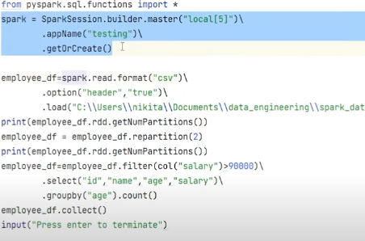

## APPLICATION, JOB, STAGE, TASK
# 1. APPLICATION:
- A Spark Application is the complete user program.

- It includes the driver process and a set of executors on the cluster.

- A single application might read data, process it, and write results.

- Example: A PySpark script to clean, transform, and write data to a table.

# 2. JOB:
- A job is triggered each time you call an action on a DataFrame/RDD.

- Actions: .collect(), .count(), .save(), .take(), etc.

- The job is divided into stages by the DAG (Directed Acyclic Graph) scheduler.

- Example: Calling .count() on a DataFrame launches a job.

# 3. STAGE
- A stage is a logical division of a job's computation, corresponding to a sequence of transformations that can be executed without shuffling data across the network. 

- Stages are determined by the presence of shuffle operations (e.g., reduceByKey, groupByKey, sortByKey) or data partitioning operations (e.g., repartition, partitionBy).

- Stages are further divided into tasks for actual execution.

# 4. TASK:
- A task is the smallest unit of work in Spark and represents the actual execution of a computation on a single partition of data.
- Each task corresponds to a single partition of an RDD and performs the transformations defined in the stage it belongs to.
- Tasks are executed in parallel across the worker nodes in the Spark cluster.
- Tasks are created for each partition of data in the RDD being operated on within a stage.

** NOTE **
- If there is a JOB then minimum there is 1 task and 1 stage.
- When there is a wide dependency transformation one new stage will create.
- Task depends on how many partitions are present.
- if there is a group by or join by default 200 tasks will create.

# EXAMPLE:
 

In above example:
1. **How many Job will create?**  
   a. read() is a action here so 1 job will create. 
   b. collect() is a action here so job 2 will create.
   So, 2 jobs will create. 

2. **How many stages will create?**  
   a. As We know for a  job  minimum 1 stage and 1 task will create so, for  job 1 there is read() so, 1 stages will create.  
   b. Now,in Job 2: When there is wide dependency transformation new stage will create, So, For Repartition(2) 1 new stage will create and then filer to select is another stage and also group by is a wide depedency transformation so again 1 new stage will create.So, for job 2, 3 stages will create. 

3. **How many tasks will create?**  
  a. so ,again As We know for a  job  minimum 1 stage and 1 task will create so, for job 1, 1 task will create.  
  b. now for job 2: there is by default 1 task will create. then for repartition(2): 2 tasks will create and for group by 200 tasks will create.so, for job 2 total 203 tasks will create.
   
  

