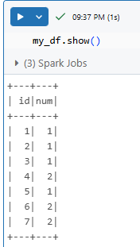

## HOW TO CREATE DATAFRAME IN SPARK:

Suppose below is Our data:
```python
my_data=[(1,   1),   
(2,   1),   
(3,   1),   
(4,   2),   
(5,   1),   
(6,   2),   
(7,   2)]
```
We have to provide schema also:
```python
my_schema=['id' , 'num' ]
```
Now we are creating dataframe using createDataFrame function:
```python
spark.createDataFrame(data=my_data,schema=my_schema).show()
```
We want to see the dataframe:
```python
my_df=spark.createDataFrame(data=my_data,schema=my_schema)
my_df.show()
```
OutPut:

